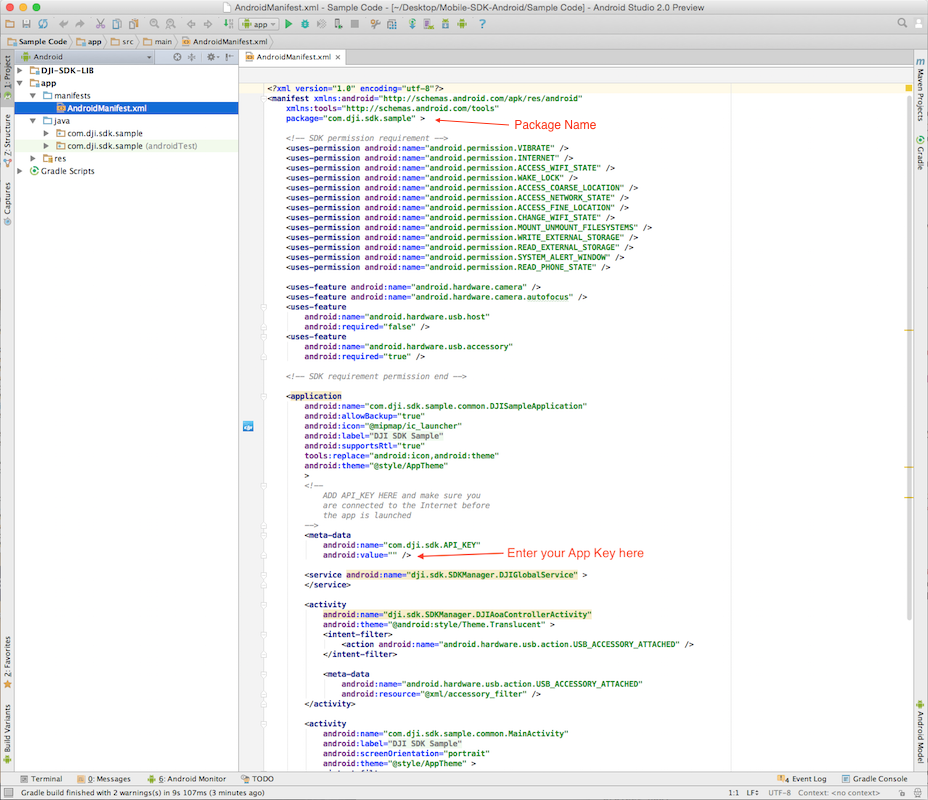

# Running DJI SDK Sample Code in Android Studio

*If you come across any mistakes or bugs in this tutorial, please let us know using a Github issue, a post on the DJI forum. Please feel free to send us Github pull request and help us fix any issues. However, all pull requests related to document must follow the [document style](https://github.com/dji-sdk/Mobile-SDK-Tutorial/issues/19)*

---

In this tutorial, you will learn how to run the DJI Android SDK Sample Code using Android Studio. We use Android Studio 2.1 for demonstration here. You can get the DJI Android SDK Sample Code from this link: <https://github.com/dji-sdk/Mobile-SDK-Android>

## Prerequisites

- Android Studio 1.5 or higher
- Android API Level 22 or higher

## Registering an App Key

Please go to your DJI Account's [User Center](http://developer.dji.com/en/user/apps/), select the "Apps" tab on the left:

Press the "Create App" button and select "Android" as your operating system. Then type in the info in the pop up dialog as shown below:

> **Important**: Please type in "com.dji.sdk.sample" in the `Package Name` field, because the Android Package Name in the DJI SDK Sample project is "com.dji.sdk.sample". We should make sure they are the same.

Once you complete it, press "Create" button to finish. Then you will see the following status:

After a few seconds, you will receive an email from DJI Developer to ask you to activate your app:

Click the link in the email to open the website and press the app you just created in User Center:

You may be able to get your App Key in the **App Information**:

## Running DJI SDK Sample Code

Please download or clone the Github Project repository to your computer and navigate to the **Sample Code** folder:

Open Android Studio, select "Open an existing Android Studio project" in the Android Studio Setup Wizard, then select the **Sample Code** folder to open the project:

### Entering App Key

Find and double click the "AndroidManifest.xml" file in left project navigator to open it.

Please substitude your App Key of the application we just created in the value attribute under the android:name="com.dji.sdk.API_KEY" attribute as shown below:

~~~xml
<!--
    ADD API_KEY HERE and make sure you
    are connected to the Internet before
    the app is launched
-->
<meta-data
    android:name="com.dji.sdk.API_KEY"
    android:value="" /> //Enter your App Key here.
~~~

### Checking Remote Controller AOA Support

Please make sure your DJI Remote Controller supports [AOA](https://source.android.com/devices/accessories/protocol.html) before you test the Sample app. You can upgrade your DJI Remote Controller to the latest firmware and check if there is a dialog pops up when you connect the app to it like this:
 

> Note: To upgrade your DJI Remote Controller's firmware, you can download the **DJI Go** app from Google Play Store: <https://play.google.com/store/apps/details?id=dji.pilot> and open it. Connect the DJI Go app to your remote controller and upgrade its firmware.

Once you finish it, build and run the project on your Android Device. Then connect the Android device to the Remote Controller, turn on the Remote Controller and the aircraft or handheld device. You can start to try different features in the sample project now! 

Here are the screenshots when you run the Sample app on Phantom 3 Professional successfully:

